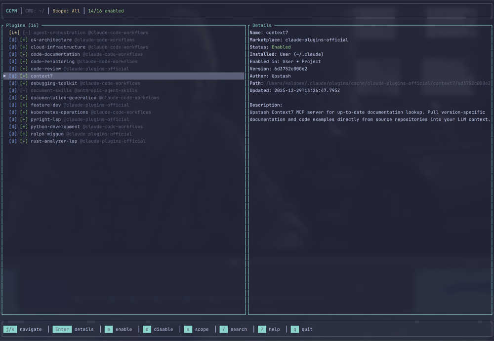

# CCPM - Claude Code Plugin Manager

[](https://github.com/ccpm/ccpm/actions/workflows/ci.yml)
[](https://opensource.org/licenses/MIT)
[](https://www.rust-lang.org)

[](docs/images/ccpm_thumbnail.png)

A terminal user interface (TUI) application for managing Claude Code plugins. Built with Rust and Ratatui, CCPM provides a lazygit-style experience for enabling, disabling, and managing your Claude Code plugins.

## Features

- **Interactive TUI**: Navigate and manage plugins with vim-style keybindings
- **Three-Scope Support**: Manage plugins at user, project, and local scope
- **Plugin Discovery**: Automatically discovers installed plugins from Claude Code configuration
- **Project Awareness**: Shows which project plugins are installed in via `projectPath`
- **CWD Display**: Header shows current working directory for context
- **Search & Filter**: Quickly find plugins by name, marketplace, or description
- **CLI Mode**: Non-interactive commands for scripting and automation
- **Safe Operations**: Atomic file writes and file locking for concurrent safety

## Installation

### From Source (Recommended)

```bash
cargo install --path .
```

### From Cargo

```bash
cargo install ccpm
```

### From Homebrew (macOS)

```bash
brew tap ccpm/homebrew-ccpm
brew install ccpm
```

## Usage

### TUI Mode

Launch the interactive interface:

```bash
ccpm
```

### Keybindings

| Key | Action |
|-----|--------|
| `j` / `↓` | Move down |
| `k` / `↑` | Move up |
| `g` | Go to first |
| `G` | Go to last |
| `Enter` / `l` / `Space` | Toggle plugin in **Local** scope (`./.claude/settings.local.json`) |
| `e` | Enable plugin in Local scope |
| `d` | Disable plugin in Local scope |
| `p` | Toggle plugin in **Project** scope (`./.claude/settings.json`, committed) |
| `u` | Toggle plugin in **User** scope (`~/.claude/settings.json`, global) |
| `i` | View plugin details (modal) |
| `s` | Cycle scope filter (All/User/Project/Local) |
| `/` | Start search |
| `Esc` | Clear search / Exit mode |
| `?` | Toggle help |
| `r` | Reload plugins |
| `q` | Quit |

The default toggle keys (`Enter` / `l` / `Space`) always write to the **Local** scope of the current working directory — perfect for per-project overrides without touching team-shared or global settings. Run CCPM from the project root where `.claude/` lives.

### Scope Indicators

In the plugin list, each plugin shows a scope indicator:

| Indicator | Meaning |
|-----------|---------|
| `[U]` (blue) | User scope - installed in `~/.claude` (global) |
| `[P]` (cyan) | Project scope - installed in current project (shared in git) |
| `[P*]` (yellow) | Project scope - installed in a different project |
| `[L]` (magenta) | Local scope - installed in current project (gitignored) |
| `[L*]` (yellow) | Local scope - installed in a different project |

The detail panel shows:
- **Installed**: Where the plugin files are physically located
- **Enabled in**: Which settings files have the plugin enabled (User, Project, Local, or combinations)
- **Project**: For project/local scopes, shows the project path (format: `~/relative/path`)

### CLI Mode

List all plugins:
```bash
ccpm list
ccpm list --scope user
ccpm list --enabled
```

Example output:
```
NAME                           MARKETPLACE               STATUS   INSTALLED  ENABLED IN
------------------------------------------------------------------------------------------
context7                       claude-plugins-official   enabled  user       User only
agent-orchestration            claude-code-workflows     enabled  local      Local only
my-custom-plugin               local-dev                 disabled local*     Disabled
```

Enable/disable plugins:
```bash
ccpm enable plugin-name@marketplace
ccpm disable plugin-name@marketplace --scope local
```

Show plugin details:
```bash
ccpm info plugin-name@marketplace
```

Example output:
```
Name:        gitlab
Marketplace: claude-plugins-official
ID:          gitlab@claude-plugins-official
Status:      disabled
Installed:   User (~/.claude)
Enabled in:  User
Settings:
  User:    enabled
  Project: (no setting)
  Local:   disabled  · ~/Projects/myapp/.claude/settings.local.json
Effective:   DISABLED (Local)
Version:     1.0.0
Path:        /Users/you/.claude/plugins/cache/claude-plugins-official/gitlab/1.0.0
```

The `Settings:` block shows the per-scope flags, and the `· <path>` suffix on Project/Local rows tells you which file contains each override — handy when a plugin's effective state surprises you because another project's local settings are pinning it.

## Configuration

CCPM reads Claude Code configuration from three scopes:

| Scope | Settings File | Purpose |
|-------|--------------|---------|
| User | `~/.claude/settings.json` | Global settings, applies to all projects |
| Project | `./.claude/settings.json` | Team-shared settings, committed to git |
| Local | `./.claude/settings.local.json` | Personal settings, gitignored |

Plugin installation data is read from:
- `~/.claude/plugins/installed_plugins.json` (includes `projectPath` for project/local scopes)
- `~/.claude/plugins/known_marketplaces.json`

### Settings Precedence

**Precedence order: Local > Project > User** (per [Claude Code docs](https://code.claude.com/docs/en/settings#how-scopes-interact))

When a plugin has settings in multiple scopes, the highest-priority scope wins:

| Local Setting | Project Setting | User Setting | Result |
|---------------|-----------------|--------------|--------|
| `true` | any | any | **Enabled** (Local wins) |
| `false` | any | any | **Disabled** (Local wins) |
| none | `true` | any | **Enabled** (Project wins) |
| none | `false` | any | **Disabled** (Project wins) |
| none | none | `true` | **Enabled** (User wins) |
| none | none | `false` | **Disabled** |
| none | none | none | **Disabled** (no setting) |

**Example**: If your team enables a plugin in `settings.json` (project), but you disable it in `settings.local.json` (local), the plugin will be **disabled** for you because local takes precedence.

This allows you to:
- Override team settings for personal preference
- Test plugins locally before sharing with the team
- Disable problematic plugins without affecting others

## Building from Source

Requirements:
- Rust 1.70 or newer

```bash
git clone https://github.com/ccpm/ccpm
cd ccpm
cargo build --release
```

The binary will be at `target/release/ccpm`.

## Cross-Platform Support

CCPM works on:
- macOS (x86_64 and arm64)
- Linux (x86_64 and arm64)
- Windows (x86_64)

## License

MIT License

## Contributing

Contributions are welcome! Please feel free to submit a Pull Request.
